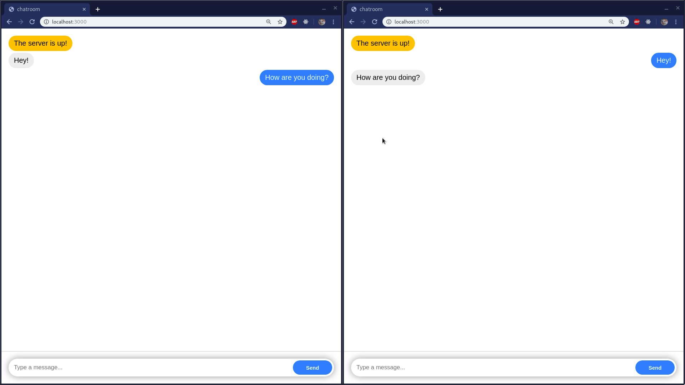

# node-chat
A private self-hosted chat server made in nodejs

## Screenshots

## Get started
- `git clone` the repo
- `cd` into the repo
- Run `npm i` to install all dependencies
- Run `npm start` to start the server
- (optional) Change the port number by replacing 3000 with the port number you want to listen on

## Brief explanation
The app uses express to serve static assets like index.html, style.css or script.js, then establishes a socket.io connection with the client webpage and pushes new messages to all clients except the one that sent it (which will add a <li> to the message list in the local DOM).

## TODO
- Add message encryption
- Replace the /messages endpoint with a socket-based message loading feature that doesn't disclose other people's IP hashes
- Add more privacy stuff if you can think of anything else
